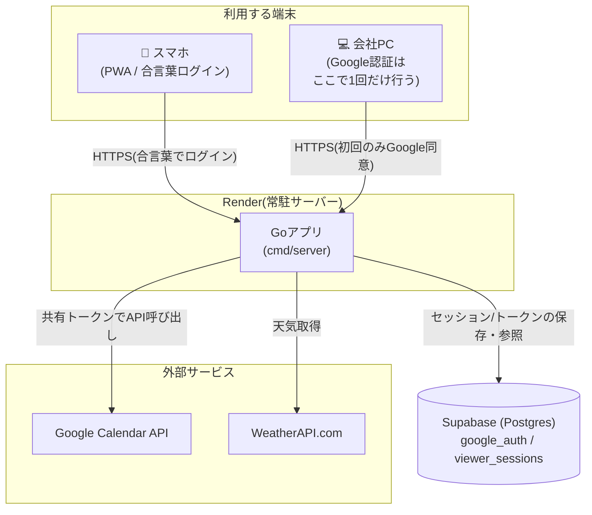
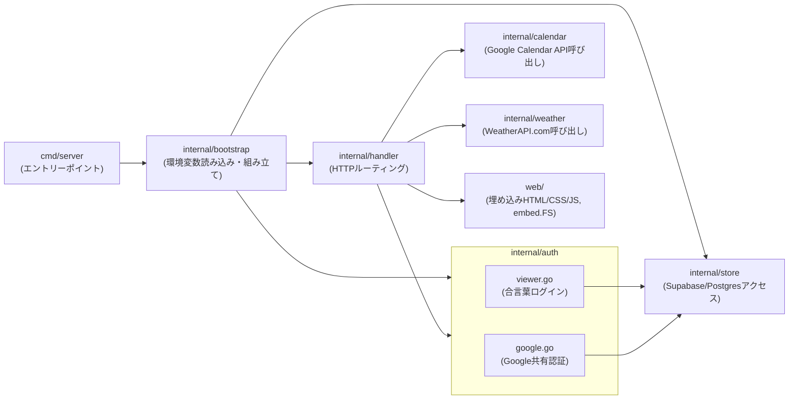

# アーキテクチャ図

個人用カレンダーアプリの全体構成。Go製のバックエンドが1つの常駐サーバーとしてRender上で動作し、Google Calendar・天気情報・データベース(Supabase)と連携する。

## システム構成図

## ポイント

- **Google認証とアプリの利用を分離している**: 会社のセキュリティポリシー上、個人デバイスからのGoogleサインインが弾かれるため、Google認証は信頼できる会社PCで1回だけ行い、発行されたリフレッシュトークンをSupabaseに保存する。以降はどの端末からのリクエストでも、サーバーがこの共有トークンを使ってGoogle Calendar APIを呼び出す(詳細: [docs/google-auth-separation.md](docs/google-auth-separation.md))
- **ダッシュボードへのアクセスは合言葉方式**: スマホなどの個人デバイスは、Googleとは無関係な合言葉(`APP_PASSWORD`)でログインする
- **常駐サーバーとして動作**: サーバーレス(Vercel)ではなく、Renderで通常のGoプロセスとして動かしている(詳細: [docs/vercel-deployment-incident.md](docs/vercel-deployment-incident.md))

## アプリケーション内部構成(Goパッケージ構成)

## 主なデータの流れ(予定を同期する場合)

1. スマホがダッシュボード(`/`)にアクセス。合言葉ログイン済みならそのまま表示
2. 「同期」ボタンを押すと `POST /api/sync/google` をサーバーへ送信
3. サーバーはSupabaseに保存されている共有のGoogle認証情報(リフレッシュトークン)を取得
4. そのトークンでGoogle Calendar APIに `GET .../events` をリクエストし、今月±1ヶ月分の予定を取得
5. 終日予定(有休・全休など)を除外し、JSON形式でスマホに返す
6. フロントエンド(`app.js`)がレスポンスを受け取り、日/週/月表示のグリッドに描画
