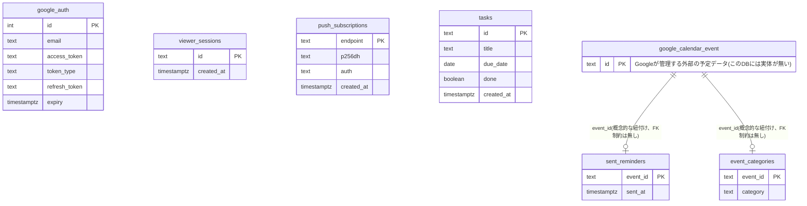

# API・データベース設計書(Personal Calendar)

対象プロジェクト: `personal-calendar`(リポジトリ: `rkoike-cpu/Private_calendar`)

## API仕様書

### 概要
会社のGoogleカレンダー・天気予報・ToDoを1画面に統合するダッシュボード型Webアプリケーションのバックエンド API。フロントエンド(素のHTML/CSS/JavaScript)から`fetch`で呼び出される、JSONベースのREST風APIとして設計している。

### 共通仕様
- ベースURL: `https://<デプロイ先ドメイン>`(本番は Render にホスティング)
- リクエスト/レスポンス形式: JSON(`Content-Type: application/json`)。一部エンドポイントはHTML(ログイン画面・ダッシュボード画面)を返す
- 日時形式: RFC3339(例: `2026-09-08T10:00:00+09:00`)

### 認証方式
2種類の認証を用途別に分離している。

1. **ビューア認証(合言葉方式)**: ダッシュボードを閲覧・操作するための認証。環境変数`APP_PASSWORD`と一致するパスワードを`POST /login`に送ると、長期間有効なセッションCookie(`viewer_session`)が発行される。以降の全APIリクエストはこのCookieで認証される
2. **Google認証(共有・1回のみ)**: Googleカレンダーへのアクセス権(OAuthリフレッシュトークン)。特定のブラウザセッションに紐付けず、**サーバー全体で共有する1件のレコード**としてDBに保存する。会社のセキュリティポリシー上、個人デバイスからのGoogleサインインが弾かれるため、信頼できる端末で1回だけ認証し、以降はサーバーが裏側でこのトークンを使い回す設計にした

### ステータスコード一覧
| コード | 意味 | 主な使用場面 |
|---|---|---|
| 200 | OK | 取得・更新成功時のJSONレスポンス |
| 204 | No Content | 削除・購読登録など、返す内容が無い成功時 |
| 302 | Found | 未ログイン時のログイン画面へのリダイレクト等 |
| 400 | Bad Request | リクエストボディ不正、必須項目欠落 |
| 401 | Unauthorized | 合言葉が誤っている |
| 403 | Forbidden | Google側の権限エラー(自分が主催者でない予定の変更など) |
| 404 | Not Found | 存在しないパス |
| 412 | Precondition Failed | Googleカレンダーが未連携の状態でAPIを呼んだ場合 |
| 500 | Internal Server Error | サーバー内部の処理エラー(DBアクセス失敗など) |
| 502 | Bad Gateway | Google Calendar API / 天気APIなど外部サービス呼び出しの失敗 |

### エンドポイント一覧

「画面・認証」はブラウザが直接ページ遷移でアクセスする(HTMLやリダイレクトを返す)エンドポイント、「API」はダッシュボード表示後にフロントエンドのJavaScriptが`fetch`でJSONをやり取りするエンドポイント、という区別で分けている。

#### 画面・認証エンドポイント(フロントエンド向け、HTML/リダイレクトを返す)

| メソッド | パス | 認証 | 概要 |
|---|---|---|---|
| GET | `/login` | 不要 | ログイン画面(合言葉入力フォーム)を返す |
| POST | `/login` | 不要 | 合言葉を検証し、セッションCookieを発行してダッシュボードへリダイレクトする |
| GET | `/` | ビューア | ダッシュボード画面(HTML)を返す |
| GET | `/sw.js` | 不要 | プッシュ通知用のService Workerスクリプトを返す |
| GET | `/auth/google/login` | ビューア | Googleの同意画面へリダイレクトする(管理者操作) |
| GET | `/auth/google/callback` | ビューア | Google認証のコールバックを受け、共有トークンを保存してダッシュボードへリダイレクトする |
| GET | `/static/*` | 不要 | CSS/JS/画像などの静的ファイル配信 |

#### APIエンドポイント(バックエンド、JSONを返す)

| メソッド | パス | 認証 | 概要 |
|---|---|---|---|
| POST | `/api/sync/google` | ビューア | 今月±1ヶ月の予定をGoogle Calendarから取得する |
| POST | `/api/events` | ビューア | 予定を新規作成する |
| PUT | `/api/events/{id}` | ビューア | 既存の予定(件名・場所・日時)を更新する |
| DELETE | `/api/events/{id}` | ビューア | 予定を削除する |
| PUT | `/api/events/{id}/category` | ビューア | 予定の色分けカテゴリを設定する(アプリ内のみの情報) |
| GET | `/api/weather/today` | ビューア | 今日1日分・時間ごとの天気予報を取得する |
| GET | `/api/push/vapid-public-key` | ビューア | プッシュ通知購読に必要なVAPID公開鍵を返す |
| POST | `/api/push/subscribe` | ビューア | プッシュ通知の購読情報を登録する |
| POST | `/api/push/unsubscribe` | ビューア | プッシュ通知の購読を解除する |
| GET | `/api/tasks` | ビューア | ToDo一覧を取得する |
| POST | `/api/tasks` | ビューア | ToDoを新規作成する |
| PATCH | `/api/tasks/{id}` | ビューア | ToDoの完了状態を更新する |
| DELETE | `/api/tasks/{id}` | ビューア | ToDoを削除する |

### 主要エンドポイントの詳細

#### POST /api/sync/google
- **リクエスト**: なし(ボディ不要)
- **レスポンス** `200 OK`:
```json
[
  {
    "ID": "3r6vuce0ivndb5fojop5n664vh",
    "Summary": "与信開発夕会",
    "Start": "2026-09-08T16:00:00+09:00",
    "End": "2026-09-08T17:00:00+09:00",
    "Location": "",
    "Category": "personal"
  }
]
```
- 終日予定(有休・全休など、時刻情報を持たない予定)は自動的に除外される
- `Category`はGoogleカレンダー本体には存在しない、このアプリ独自の付加情報

#### POST /api/events
- **リクエスト**:
```json
{ "summary": "打ち合わせ", "location": "東京駅", "start": "2026-09-08T10:00:00+09:00", "end": "2026-09-08T11:00:00+09:00" }
```
- **レスポンス** `200 OK`: 作成された予定(構造は上記と同じ)

#### PUT /api/events/{id}/category
- **リクエスト**: `{ "category": "important" }`(空文字でカテゴリ解除)
- **レスポンス**: `204 No Content`
- Googleカレンダー本体には一切書き込まない、DBのみの更新

---

## データベース仕様書

### 概要
Supabase(PostgreSQL)を使用。個人利用の単一ユーザーアプリのため、ユーザーを区別する列は持たず、テーブルごとに「サーバー全体で共有する状態」または「予定ID・端末ごとの状態」を保持するシンプルな構成にしている。

### テーブル一覧
| テーブル名 | 役割 |
|---|---|
| `google_auth` | Googleカレンダーへの共有アクセス権(1件のみ) |
| `viewer_sessions` | ダッシュボードへのログインセッション |
| `push_subscriptions` | プッシュ通知の購読情報(端末ごと) |
| `sent_reminders` | リマインダー通知の送信済み記録(予定ごと) |
| `event_categories` | 予定の色分けカテゴリ(予定ごと、アプリ内のみ) |
| `tasks` | ToDo項目 |

### 各テーブルの詳細

#### google_auth
| カラム名 | 型 | 制約 | 説明 |
|---|---|---|---|
| id | INTEGER | PRIMARY KEY | 常に`1`固定(1件のみ保持するため) |
| email | TEXT | NOT NULL | 認証したGoogleアカウントのメールアドレス |
| access_token | TEXT | NOT NULL | アクセストークン |
| token_type | TEXT | | トークン種別 |
| refresh_token | TEXT | | リフレッシュトークン |
| expiry | TIMESTAMPTZ | | アクセストークンの有効期限 |

インデックス: `id`(主キー)のみ。1行しか存在しないためこれで十分。

#### viewer_sessions
| カラム名 | 型 | 制約 | 説明 |
|---|---|---|---|
| id | TEXT | PRIMARY KEY | セッションID(ランダム生成、Cookieの値と一致) |
| created_at | TIMESTAMPTZ | NOT NULL DEFAULT now() | 作成日時 |

インデックス: `id`(主キー)のみ。認証時は`id`の完全一致検索のみのため十分。

#### push_subscriptions
| カラム名 | 型 | 制約 | 説明 |
|---|---|---|---|
| endpoint | TEXT | PRIMARY KEY | ブラウザのプッシュ購読エンドポイントURL(端末ごとに一意) |
| p256dh | TEXT | NOT NULL | 暗号化用の公開鍵 |
| auth | TEXT | NOT NULL | 認証シークレット |
| created_at | TIMESTAMPTZ | NOT NULL DEFAULT now() | 登録日時 |

インデックス: `endpoint`(主キー)のみ。

#### sent_reminders
| カラム名 | 型 | 制約 | 説明 |
|---|---|---|---|
| event_id | TEXT | PRIMARY KEY | Googleカレンダーの予定ID(外部システムのID) |
| sent_at | TIMESTAMPTZ | NOT NULL DEFAULT now() | 通知送信日時 |

インデックス: `event_id`(主キー)のみ。「この予定は通知済みか」の存在確認クエリのみのため十分。

#### event_categories
| カラム名 | 型 | 制約 | 説明 |
|---|---|---|---|
| event_id | TEXT | PRIMARY KEY | Googleカレンダーの予定ID(外部システムのID) |
| category | TEXT | NOT NULL | 色分けカテゴリ(`personal`/`important`/`travel`など) |

インデックス: `event_id`(主キー)のみ。

#### tasks
| カラム名 | 型 | 制約 | 説明 |
|---|---|---|---|
| id | TEXT | PRIMARY KEY | タスクID(ランダム生成) |
| title | TEXT | NOT NULL | タスク名 |
| due_date | DATE | | 期限日(任意) |
| done | BOOLEAN | NOT NULL DEFAULT false | 完了状態 |
| created_at | TIMESTAMPTZ | NOT NULL DEFAULT now() | 作成日時 |

インデックス: `id`(主キー)のみ。

---

## ER図



※このアプリのテーブル同士には、DB上の外部キー制約による関連は存在しない。`sent_reminders`と`event_categories`の`event_id`は、DB内の別テーブルではなく**Googleカレンダー側(外部システム)の予定ID**と紐付くキーであり、実体を持たない「概念的な関連」である点が特徴(図中の`google_calendar_event`は実際にはこのDBに存在しない、説明のための仮想エンティティ)。

---

## 設計判断

### エンドポイントの粒度
- 予定本体の更新(`PUT /api/events/{id}`)と、色分けカテゴリの更新(`PUT /api/events/{id}/category`)を**あえて別エンドポイントに分離**する設計にした。理由は、前者はGoogleカレンダー本体への書き込み(自分が主催者でない予定では失敗し得る)、後者はこのアプリのDBのみへの書き込み(必ず成功する)という、**信頼性も影響範囲も全く異なる処理**だと考えたため。1つのエンドポイントにまとめてしまうと、「Google側の更新が失敗したらカテゴリの変更も道連れで失われる」という不具合が起こり得ると想定した。エンドポイントを分けることで、「予定の主催者ではないため件名変更はできないが、色分けだけは必ず反映される」という、利用者にとって自然な挙動を実現できると考えている
- ToDoの完了状態の切り替えは`PUT`ではなく`PATCH`を採用した。タスクの一部フィールド(`done`)だけを更新する操作であり、リソース全体を置き換える`PUT`の意味とは合わないため

### テーブル分割・リレーション設計
- 通常のアプリであれば「1つの予定に対して、カテゴリや通知履歴を持つ」という関連をFK制約で表現するところだが、**予定の実体はこのアプリのDBではなくGoogleカレンダー側にある**ため、ローカルDBのテーブル同士を無理にFKで結ぶ設計にはしなかった。`event_categories`や`sent_reminders`は、Googleの予定IDを主キーとして持つだけの、独立した「付加情報テーブル」として設計している
- 同様の理由で、`google_auth`・`viewer_sessions`・`push_subscriptions`・`tasks`もお互いに関連を持たない独立したテーブルである。これは「利用者が自分1人だけ」という個人用アプリの前提だからこそ成立する割り切りで、複数ユーザーに対応する場合はこの設計を見直す必要がある(実際、複数ユーザー対応は今後の課題として別途検討している)

### インデックス選定
- 全テーブルとも、主キー以外の追加インデックスは作成していない。理由は、個人利用規模のデータ量(多くても数千行程度)であれば主キーの完全一致検索だけで十分高速であり、追加インデックスによる書き込みコスト増のデメリットの方が大きいと判断したため

### 予定データ自体をキャッシュしない設計
- このDBには、予定の件名・日時・場所といった**予定データそのものは一切保存していない**。ダッシュボードを開くたび・同期ボタンを押すたびに、常にGoogle Calendar APIへ問い合わせて最新のデータを取得する「ステートレスな窓口」方式にしている
- この判断は「同期ボタンを押した時だけ最新化する」というシンプルなUXを実現する目的に加えて、**複数ユーザーに対応する場合でも、DBの負荷が利用者数やその予定数に比例して増えない**という利点があると考えている。もし予定データをローカルにキャッシュする設計にした場合、利用者が増えるほど「人数分の予定データ+同期のたびの差分管理」というデータ量・実装複雑さの両方が比例して増大する懸念がある
- 個人用アプリだからこそ成立する設計というより、**そもそも利用者数のスケールに対して破綻しにくい設計を採用している**、という方が正確な捉え方だと考えている
- 一方でトレードオフもある。オフライン時には何も表示できない、過去の予定の傾向を分析するような機能は作りにくい、といった制約は残る

## まとめ

### 設計中に苦労したこと・判断に迷ったこと
- **認証設計の分離**: 「Googleにサインインした人が、そのままダッシュボードを見られる」という一体型の認証にする案も検討したが、会社のセキュリティポリシー上、個人のスマホからGoogleへ直接サインインできないケースが想定されるため、この一体型の設計では成立しないと考えた。そこで設計の時点で、「Google認証(共有・1回のみ)」と「ダッシュボードへのログイン(合言葉・端末問わず)」を分離する方針にした。これにより認証まわりのテーブル・処理の設計が、単純な一体型よりも複雑になった
- **エンドポイントの粒度**: 予定の更新とカテゴリの更新を1つのエンドポイントにまとめる案も考えられたが、その場合「Google側への書き込みが(主催者でない等の理由で)失敗すると、本来無関係なはずのアプリ内だけのカテゴリ変更まで巻き込まれて失敗してしまう」という懸念があった。この懸念を踏まえ、「Google側への書き込みを伴う処理」と「アプリ内のDBのみで完結する処理」を明確に分離するエンドポイント設計にした

### 学んだこと
- 今回、DB設計自体は元々FK制約を使わない形にしていたが、**アプリのコード側で「Google側への更新が成功した場合だけ、アプリ内のカテゴリ更新も呼び出す」という処理の順序に依存させてしまっていた**ため、DBの構造とは別に、実質的にFKで結んでいるのと同じような「巻き込まれ」が起きてしまっていた。この経験から、DB設計・API設計のどちらのレベルでも、**外部サービスに依存する処理と、アプリ内だけで完結する処理は明確に分離しておくべき**という教訓を得た
- 外部サービス(Google Calendar)の実体を持つデータと、自アプリ独自の付加データを同じDBで扱う場合、**無理にFKで結ばず、外部IDをキーにした独立テーブルとして持つ**方が、外部サービス側の制約(権限エラーなど)に振り回されにくい設計になる
- API設計は「データの見た目上の関連」だけでなく、「更新が失敗し得る単位」でエンドポイントを分けることが、実際の障害耐性に直結する
