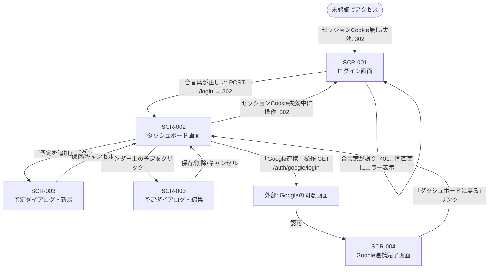

# 画面設計書(Personal Calendar)

## 画面一覧

| 画面ID | 画面名 | 画面の目的 | 主要な要素 | 関連するAPIエンドポイント |
|---|---|---|---|---|
| [SCR-001](#design-scr-001) | ログイン画面 | 合言葉を入力し、ダッシュボードへのアクセス権(セッションCookie)を得る | パスワード入力欄、ログインボタン、認証失敗時のエラーメッセージ | `POST /login` |
| [SCR-002](#design-scr-002) | ダッシュボード画面 | 会社カレンダー・天気・ToDoを1画面に統合表示し、各種操作の起点となるメイン画面 | ヘッダー(通知ボタン・予定追加ボタン・同期ボタン)、今日の天気ストリップ、ToDoリスト(入力欄・一覧・完了チェック・削除)、日/週/月の表示切替、カレンダー本体(時間軸グリッド)、予定ホバー時のポップオーバー(件名・時間・場所の簡易表示) | `POST /api/sync/google`、`GET /api/weather/today`、`GET /api/tasks`、`POST /api/tasks`、`PATCH /api/tasks/{id}`、`DELETE /api/tasks/{id}`、`GET /api/push/vapid-public-key`、`POST /api/push/subscribe`、`POST /api/push/unsubscribe` |
| [SCR-003](#design-scr-003) | 予定追加・編集ダイアログ | 新規予定の作成、または既存予定の件名・場所・日時の編集・削除・色分けカテゴリ設定を行う(ダッシュボード画面上のモーダルとして表示し、独立したページ遷移は発生させない想定) | 件名・場所・開始/終了日時の入力欄、色分けカテゴリ選択、場所からGoogleマップを開くリンク、削除ボタン(編集時のみ表示)、バリデーション/Google側エラーの表示欄 | `POST /api/events`、`PUT /api/events/{id}`、`DELETE /api/events/{id}`、`PUT /api/events/{id}/category` |
| [SCR-004](#design-scr-004) | Google連携完了画面 | Googleの同意画面から戻ってきた際に、カレンダー連携が完了したことを伝える簡易確認画面 | 連携完了メッセージ(連携したメールアドレスを表示)、ダッシュボードへ戻るリンク | なし(表示前に裏側で`SaveGoogleAuth`によるトークン保存を完了させておく) |

各行の画面IDは、[設計判断](#設計判断)内の対応する項目にリンクしている。

### 画面として扱わない想定のもの(補足)

- **予定のポップオーバー**: カレンダー上の予定にマウスを重ねた際に件名・時間・場所を表示する小さな吹き出し。クリックやページ遷移を伴わないホバー専用のUI部品として設計するため、独立した画面ではなく[SCR-002](#design-scr-002)の要素として扱う
- **Googleの同意画面**: `GET /auth/google/login`のリダイレクト先。Google側が提供する画面であり、このアプリの画面設計の対象外(遷移図では「外部」として扱う)
- **プッシュ通知の許可ダイアログ**: ブラウザが表示するネイティブUIであり、このアプリで作り込む画面には含めない

## 画面遷移図

## 設計判断

### [SCR-003] 予定操作をページ遷移ではなくモーダルに留める
予定の追加・編集(SCR-003)は独立したページに分けず、ダッシュボード上のダイアログ(モーダル)として実装する方針にする。カレンダー全体の表示を保ったまま予定を操作できるようにする狙いで、ページ遷移によって「今どこを見ていたか」を見失わせないようにする判断をした。この結果、画面遷移図の上では「別画面への遷移」ではなく「同一画面内の状態変化」として表現している。

### [SCR-002 / SCR-004] Google連携をダッシュボードへの入り口から切り離す
Google連携(SCR-004に至る一連の流れ)は、通常のログイン動線(SCR-001→SCR-002)とは独立した、ダッシュボード上のボタンから任意のタイミングで行う「管理者操作」として設計する。[api-db-design.md](api-db-design.md)の認証設計の通り、ビューア認証(合言葉)とGoogle認証(共有・1回のみ)を分離した方針を、画面遷移の構造にもそのまま反映させる。

### [SCR-001 / SCR-002] 未ログイン時の遷移先を一本化する
保護された画面(SCR-002)・APIのどちらにセッション切れの状態でアクセスしても、遷移先は常にSCR-001(ログイン画面)に統一する。画面ごとに異なるエラー画面を用意せず、「未認証なら常にログイン画面に戻す」というシンプルな規則にすることで、遷移パターンの数を増やさない判断をした。

### カバーしない操作パターン
- **ログアウト機能** ([SCR-001](#design-scr-001)/[SCR-002](#design-scr-002)): 明示的にセッションを破棄する画面・ボタンは設けない。合言葉が漏洩した場合の対処は「サーバー側で`APP_PASSWORD`を変更する」運用でのみ対応する想定とし、画面設計の対象からは外す
- **合言葉を忘れた場合の再発行フロー** ([SCR-001](#design-scr-001)): `APP_PASSWORD`は環境変数による固定値とする想定のため、アプリ内での再発行機能は設計しない
- **Google連携の解除画面** ([SCR-004](#design-scr-004)): 連携済みのGoogleアカウントを付け替える・解除する専用画面は設けず、再度`/auth/google/login`を実行してGoogle側で別アカウントを選び直すことで上書きする想定とする(明示的な「解除」操作は対象外)

## まとめ

### 設計中に苦労したこと・判断に迷ったこと
- 予定の追加・編集([SCR-003](#design-scr-003))を「独立した画面」として画面一覧に含めるべきか、それとも「ダッシュボードの一要素」として扱うべきか迷った。モーダルダイアログとして実装する予定ではあるが、ユーザーの操作単位としては「予定を編集する」という明確な目的を持つまとまりのため、最終的には画面一覧には1エントリとして残しつつ、遷移図上は「別画面への遷移」ではなく同一画面内の状態変化として描くことで整合を取った
- 予定のポップオーバー(ホバー表示、[SCR-002](#design-scr-002)の要素)を画面として数えるかどうかも同様に迷ったが、遷移(クリックやページ移動)を一切伴わない点を基準に、画面には含めない判断をした

### 学んだこと
- 画面遷移図は「実装上のファイル・URLの単位」ではなく、「ユーザーから見た操作のまとまり」を基準に描くべきだと実感した。今回のダッシュボードのように、1つのHTMLファイルに実装する予定でも、ユーザー体験としては複数の目的(閲覧・予定編集・Google連携)が同居する場合、後者の基準で画面を切り出す方が、後から見返した際に迷いにくい設計書になる
- API仕様書(Step 2)の時点でエンドポイントを「画面・認証」と「API」に分けて整理していたことが、今回の画面一覧作成の土台としてそのまま活きた。API設計と画面設計は別工程ではあるが、エンドポイント単位の整理が先にあると、画面ごとの「関連するAPI」の洗い出しが機械的に進められる
